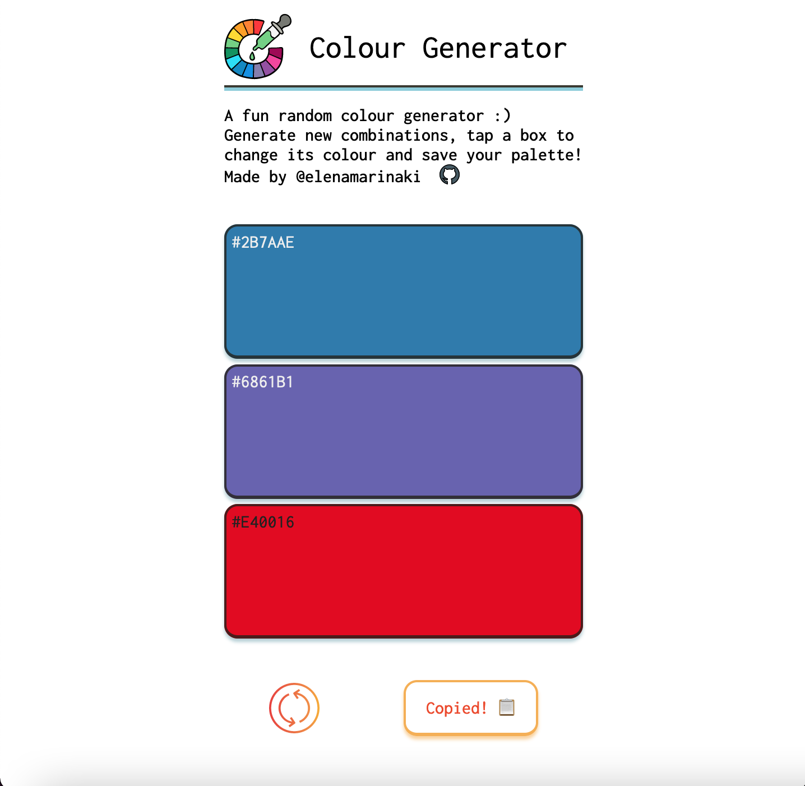
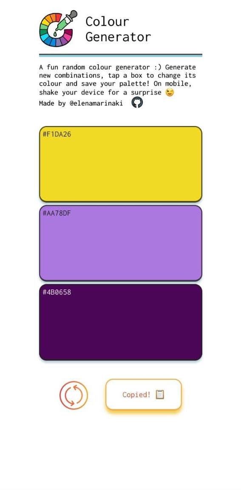

# Mobile Colour Scheme Generator

This is a colour scheme generator optimized for mobile devices.

:red_square: :orange_square: :yellow_square: :green_square: :blue_square: :purple_square: :brown_square:

### Base functionality 🎨

- A set of colours is randomly generated (from a pre-defined array with hex colour colour codes)
- The user can generate a random combination of colours either by refreshing the page or by using the `refresh` button bottom left.
- Each colour can be changed individually, by taping (on mobile) or clicking (on desktop) the desired colour box.
- If the user wants to save a combination, they can press the button bottom right to copy the hex codes to the clipboard. For this function, I have used the Clipboard API.

### Recent Updates 🪄

- The colours are now randomly generated through a function that generates random hex codes, and not from a pre-defined array.
- The `save` button has been changed. After being clicked, the inside text is being replaced, instead of adding another template.
- Shake device for random colour set. Additional script used for this found [here](https://cdn.rawgit.com/alexgibson/shake.js/master/shake.js).

### Testing 🧪
- The application has been tested in Firefox, Chrome and Safari.
- The `shake` function works so far in Android, but it seems not to be working in iOS. More testing needs to be done as to why this is the case.

### Coming next ...

- Adjust for desktop

<!--  -->

