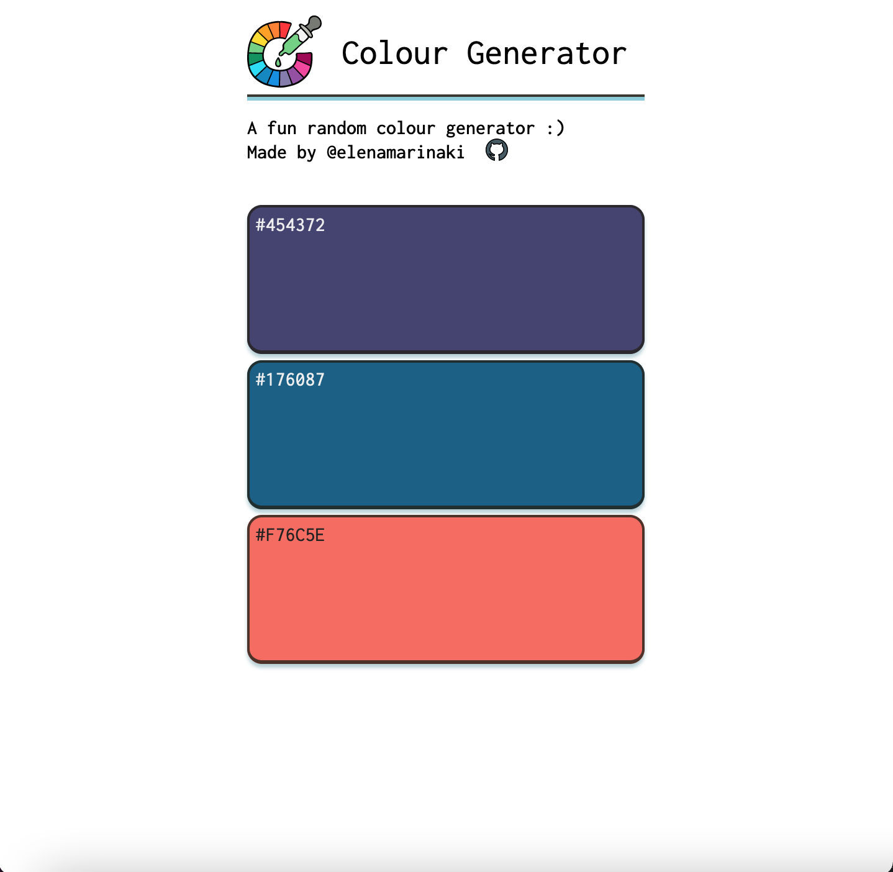
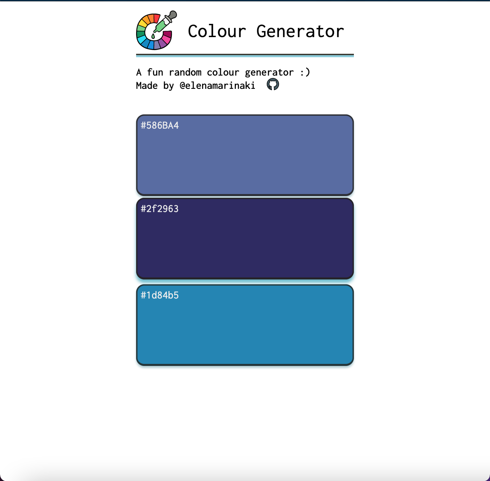

# Mobile Colour Scheme Generator

This is a colour scheme generator optimized for mobile devices.

### Base functionality 🎨
* A set of colours is randomly generated (from a pre-defined array with hex colour colour codes - I will implement a function that  randomly generates a hex code shortly)
* The user can generate a random combination of colours either by refreshing the page or by using the `refresh` button bottom left.
* Each colour can be changed individually, by taping (on mobile) or clicking (on desktop) the desired colour box.
* If the user wants to save a combination, they can press the button bottom right to copy the hex codes to the clipboard. For this function, I have used the Clipboard API.

